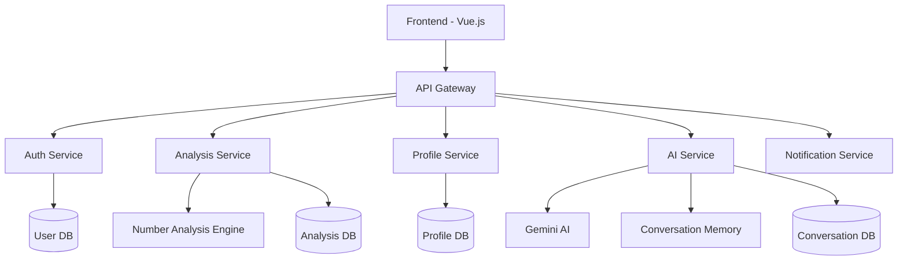
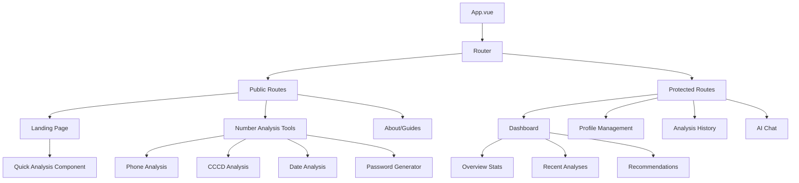

# PRD - PHONG THỦY SỐ - KIẾN TRÚC MỚI

## 1. PHÂN TÍCH CẤU TRÚC HIỆN TẠI

### 1.1 Frontend (Vue.js)
**Cấu trúc hiện tại:**
```
phong_thuy_so/
├── src/
│   ├── components/
│   │   ├── analysis/       # Các component phân tích
│   │   ├── auth/          # Authentication
│   │   ├── chat/          # Chat interface
│   │   ├── layout/        # Layout components
│   │   └── payment/       # Payment components
│   ├── views/
│   │   ├── guides/        # Các trang hướng dẫn riêng lẻ
│   │   ├── HomeView.vue   # Landing page
│   │   ├── AppView.vue    # Main app interface
│   │   └── LoginView.vue  # Login page
│   ├── stores/            # Pinia stores
│   ├── services/          # API services
│   └── router/            # Vue Router config
```

**Điểm mạnh:**
- Cấu trúc Vue.js chuẩn, dễ maintain
- Có PWA support
- Responsive design với Tailwind CSS
- Pinia store management tốt

**Điểm yếu:**
- Chỉ hỗ trợ phân tích số điện thoại
- Landing page thiếu tính tương tác
- Không có hệ thống phân tích đa dạng (CCCD, ngày sinh, v.v.)
- Thiếu khả năng lưu trữ profile số học cá nhân

### 1.2 Backend (Node.js + Express)
**Cấu trúc hiện tại:**
```
chatbotsdtapi/
├── controllers/           # Route handlers
│   ├── analysisController.js
│   ├── authController.js
│   ├── cccdAnalysisController.js  # Đã có sẵn
│   └── chatController.js
├── models/               # MongoDB models
│   ├── User.js
│   ├── Analysis.js
│   └── Payment.js
├── services/             # Business logic
│   ├── analysisService.js
│   └── geminiService.js  # AI integration
├── routes/               # Route definitions
└── middleware/           # Auth, quota middleware
```

**Điểm mạnh:**
- Có sẵn AI integration (Gemini)
- Hỗ trợ multiple AI models
- Có CCCD analysis controller
- Authentication & payment system
- Quota management

**Điểm yếu:**
- Chỉ có model Analysis đơn giản
- Thiếu profile system tổng hợp
- Chưa có hệ thống follow-up conversation
- Thiếu categorization cho các loại số

## 2. ĐỀ XUẤT KIẾN TRÚC MỚI

### 2.1 Tổng quan Kiến trúc

#### 2.1.1 Microservices Architecture


#### 2.1.2 Frontend Architecture


### 2.2 Chi tiết Kiến trúc Mới

#### 2.2.1 Frontend Restructure

**New File Structure:**
```
phong_thuy_so/
├── src/
│   ├── components/
│   │   ├── landing/           # NEW: Landing page components
│   │   │   ├── HeroSection.vue
│   │   │   ├── QuickAnalysis.vue
│   │   │   ├── FeatureShowcase.vue
│   │   │   └── NumberTypeSelector.vue
│   │   ├── analysis/
│   │   │   ├── universal/     # NEW: Universal analysis components
│   │   │   │   ├── NumberTypeAnalyzer.vue
│   │   │   │   ├── ResultDisplay.vue
│   │   │   │   └── AnalysisComparison.vue
│   │   │   ├── phone/         # Existing phone analysis
│   │   │   ├── cccd/          # NEW: CCCD analysis
│   │   │   ├── date/          # NEW: Date analysis
│   │   │   └── password/      # NEW: Password analysis
│   │   ├── profile/           # NEW: Profile management
│   │   │   ├── NumberProfile.vue
│   │   │   ├── PersonalNumbers.vue
│   │   │   └── AnalysisTimeline.vue
│   │   ├── ai-chat/           # ENHANCED: AI chat system
│   │   │   ├── ConversationThread.vue
│   │   │   ├── ContextAwareChat.vue
│   │   │   └── FollowUpSuggestions.vue
│   │   └── dashboard/         # NEW: User dashboard
│   │       ├── OverviewStats.vue
│   │       ├── RecentActivity.vue
│   │       └── Recommendations.vue
│   ├── views/
│   │   ├── LandingView.vue    # ENHANCED: New landing page
│   │   ├── AnalysisView.vue   # NEW: Universal analysis page
│   │   ├── DashboardView.vue  # NEW: User dashboard
│   │   ├── ProfileView.vue    # NEW: Profile management
│   │   └── ChatView.vue       # NEW: Dedicated AI chat page
│   ├── stores/
│   │   ├── analysis.js        # ENHANCED: Support multiple types
│   │   ├── profile.js         # NEW: Profile management
│   │   ├── aiChat.js          # NEW: AI conversation state
│   │   └── dashboard.js       # NEW: Dashboard state
│   └── services/
│       ├── analysisService.js # ENHANCED: Multiple analysis types
│       ├── profileService.js  # NEW: Profile management
│       └── aiChatService.js   # NEW: AI chat service
```

#### 2.2.2 Backend Restructure

**Enhanced File Structure:**
```
chatbotsdtapi/
├── controllers/
│   ├── analysisController.js      # ENHANCED: Universal analysis
│   ├── profileController.js       # NEW: Profile management
│   ├── aiChatController.js        # NEW: Enhanced AI chat
│   └── dashboardController.js     # NEW: Dashboard data
├── models/
│   ├── User.js                    # ENHANCED: Add profile fields
│   ├── NumberProfile.js           # NEW: Personal number profile
│   ├── Analysis.js                # ENHANCED: Support multiple types
│   ├── Conversation.js            # NEW: AI conversation history
│   └── NumberType.js              # NEW: Number type definitions
├── services/
│   ├── analysisEngine/            # NEW: Analysis engine
│   │   ├── phoneAnalysis.js
│   │   ├── cccdAnalysis.js
│   │   ├── dateAnalysis.js
│   │   └── universalAnalysis.js
│   ├── aiService/                 # ENHANCED: AI service
│   │   ├── geminiService.js
│   │   ├── conversationManager.js
│   │   └── contextBuilder.js
│   └── profileService.js          # NEW: Profile management
└── routes/
    ├── analysis.js                # ENHANCED: Multiple types
    ├── profile.js                 # NEW: Profile routes
    ├── aiChat.js                  # NEW: AI chat routes
    └── dashboard.js               # NEW: Dashboard routes
```

### 2.3 Database Schema Mới

#### 2.3.1 Enhanced User Model
```javascript
// models/User.js - ENHANCED
{
  // Existing fields...
  profile: {
    personalNumbers: {
      phoneNumber: String,
      cccdNumber: String,
      birthDate: Date,
      luckyNumbers: [Number],
      preferredPasswords: [String]
    },
    preferences: {
      analysisDepth: { type: String, enum: ['basic', 'detailed', 'comprehensive'] },
      aiPersonality: { type: String, enum: ['professional', 'friendly', 'mystical'] },
      notificationSettings: Object
    },
    analysisStats: {
      totalAnalyses: Number,
      favoriteNumberTypes: [String],
      lastAnalysisDate: Date
    }
  }
}
```

#### 2.3.2 Enhanced Analysis Model
```javascript
// models/Analysis.js - ENHANCED
{
  userId: ObjectId,
  analysisType: { type: String, enum: ['phone', 'cccd', 'date', 'password', 'custom'] },
  inputData: {
    value: String,
    type: String,
    metadata: Object  // Additional context
  },
  result: {
    // Existing analysis fields...
    confidence: Number,
    analysisDepth: String,
    recommendations: [String],
    relatedAnalyses: [ObjectId]
  },
  aiInteraction: {
    geminiResponse: String,
    conversationId: ObjectId,
    followUpQuestions: [String],
    userSatisfaction: Number
  },
  createdAt: Date,
  updatedAt: Date
}
```

#### 2.3.3 New Models

**NumberProfile Model:**
```javascript
// models/NumberProfile.js - NEW
{
  userId: ObjectId,
  profileType: { type: String, enum: ['personal', 'business', 'family'] },
  numbers: [{
    type: String,  // 'phone', 'cccd', 'birthdate', etc.
    value: String,
    nickname: String,
    isActive: Boolean,
    analysisHistory: [ObjectId],
    lastAnalyzed: Date
  }],
  overallProfile: {
    dominantElements: [String],
    personalityTraits: [String],
    luckyPeriods: [Object],
    recommendations: [String]
  },
  createdAt: Date,
  updatedAt: Date
}
```

**Conversation Model:**
```javascript
// models/Conversation.js - NEW
{
  userId: ObjectId,
  analysisId: ObjectId,  // Optional: linked to specific analysis
  messages: [{
    role: { type: String, enum: ['user', 'assistant'] },
    content: String,
    timestamp: Date,
    context: Object  // Analysis context, user profile, etc.
  }],
  context: {
    currentNumbers: [String],
    analysisType: String,
    userGoals: [String],
    previousTopics: [String]
  },
  aiModel: String,
  isActive: Boolean,
  createdAt: Date,
  updatedAt: Date
}
```

## 3. IMPLEMENTATION ROADMAP

### Phase 1: Core Infrastructure (2-3 weeks)
1. **Database Schema Migration**
   - Enhance existing models
   - Create new models (NumberProfile, Conversation)
   - Data migration scripts

2. **Backend API Enhancement**
   - Universal analysis controller
   - Profile management API
   - Enhanced AI chat API

3. **Frontend Restructure**
   - New component structure
   - Enhanced stores
   - New services

### Phase 2: Landing Page & Analysis Tools (2-3 weeks)
1. **Enhanced Landing Page**
   - Interactive number type selector
   - Quick analysis tools
   - Real-time demos

2. **Universal Analysis Engine**
   - Support for multiple number types
   - Comparison tools
   - Result visualization

3. **Profile System**
   - Personal number profiles
   - Analysis history
   - Recommendations engine

### Phase 3: AI Enhancement (2-3 weeks)
1. **Context-Aware AI**
   - Conversation memory
   - Profile-based responses
   - Follow-up question system

2. **Advanced Features**
   - Multi-number analysis
   - Trend analysis
   - Predictive recommendations

### Phase 4: Dashboard & Advanced Features (2-3 weeks)
1. **User Dashboard**
   - Analytics overview
   - Progress tracking
   - Personalized insights

2. **Advanced Analysis**
   - Pattern recognition
   - Compatibility analysis
   - Business number optimization

## 4. KEY FEATURES MỚI

### 4.1 Landing Page Tương Tác
- **Number Type Selector**: Cho phép chọn loại số để phân tích
- **Quick Analysis**: Phân tích nhanh không cần đăng ký
- **Live Demo**: Hiển thị kết quả thực tế
- **Progressive Disclosure**: Hiển thị thông tin chi tiết dần

### 4.2 Universal Analysis System
- **Multi-Type Support**: Điện thoại, CCCD, ngày sinh, mật khẩu
- **Context-Aware**: Hiểu mối liên hệ giữa các loại số
- **Comparison Tools**: So sánh nhiều số cùng lúc
- **Depth Control**: Chọn mức độ phân tích (cơ bản/chi tiết/toàn diện)

### 4.3 Personal Number Profile
- **Centralized Management**: Quản lý tất cả số cá nhân
- **Timeline View**: Xem lịch sử phân tích theo thời gian
- **Pattern Recognition**: Nhận diện xu hướng cá nhân
- **Smart Recommendations**: Đề xuất dựa trên profile

### 4.4 Enhanced AI Chat
- **Conversation Memory**: Nhớ ngữ cảnh cuộc trò chuyện
- **Profile Integration**: Sử dụng thông tin profile để trả lời
- **Follow-up System**: Đặt câu hỏi tiếp theo thông minh
- **Multi-Modal**: Hỗ trợ text, hình ảnh, voice (future)

### 4.5 Analytics Dashboard
- **Personal Insights**: Thống kê phân tích cá nhân
- **Trend Analysis**: Xu hướng số học theo thời gian
- **Goal Tracking**: Theo dõi mục tiêu cải thiện
- **Recommendation Engine**: Đề xuất hành động

## 5. TECHNICAL SPECIFICATIONS

### 5.1 Performance Requirements
- **Response Time**: < 2s cho phân tích cơ bản, < 5s cho phân tích chi tiết
- **Concurrent Users**: Support 1000+ concurrent users
- **Database**: MongoDB with proper indexing
- **Caching**: Redis for frequently accessed data
- **CDN**: Static assets delivery

### 5.2 Security & Privacy
- **Data Encryption**: All personal numbers encrypted at rest
- **API Security**: JWT tokens, rate limiting, input validation
- **Privacy Controls**: User can delete all personal data
- **Audit Trail**: Log all analysis activities

### 5.3 Scalability
- **Horizontal Scaling**: Docker containers, load balancers
- **Database Sharding**: Partition by user regions
- **AI Model Management**: Multiple AI providers, fallback mechanisms
- **Monitoring**: Real-time performance monitoring

## 6. SUCCESS METRICS

### 6.1 User Engagement
- **Daily Active Users**: Target 10,000+ DAU
- **Session Duration**: Average 15+ minutes
- **Analysis per User**: 5+ analyses per session
- **Return Rate**: 70%+ weekly return rate

### 6.2 Feature Adoption
- **Profile Creation**: 80%+ of registered users
- **Multi-Type Analysis**: 60%+ users try multiple types
- **AI Chat Usage**: 50%+ users engage with AI chat
- **Premium Conversion**: 15%+ conversion rate

### 6.3 Technical Metrics
- **API Response Time**: 95% requests < 2s
- **Uptime**: 99.9%+ availability
- **Error Rate**: < 0.1% error rate
- **AI Accuracy**: 90%+ user satisfaction rating

## 7. CONCLUSION

Kiến trúc mới sẽ biến ứng dụng từ một công cụ phân tích số điện thoại đơn giản thành một hệ sinh thái phong thủy số học toàn diện. Với việc tích hợp AI thông minh, profile cá nhân hóa, và giao diện tương tác phong phú, người dùng sẽ có trải nghiệm hoàn toàn mới trong việc khám phá và ứng dụng số học vào cuộc sống.

Roadmap 8-12 tuần này sẽ đưa sản phẩm lên một tầm cao mới, phục vụ nhu cầu đa dạng của người dùng từ cơ bản đến chuyên sâu.