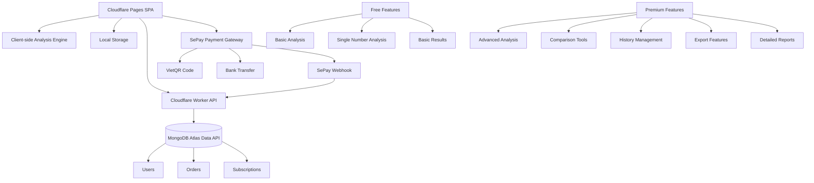
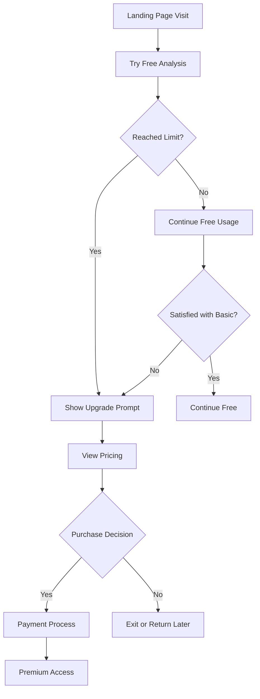

# PRD - PHONG THỦY SỐ - PHIÊN BẢN THÁNG 6 (CLOUDFLARE EDGE)

## 1. PHÂN TÍCH TÍNH NĂNG HIỆN TẠI

### 1.1 Tính năng trong universalAnalysis.js
**Đã có sẵn:**
- Universal analysis cho nhiều loại số (phone, cccd, birthdate, bankAccount, password, licensePlate)
- Validation input cho từng loại số
- Lưu trữ lịch sử phân tích (localStorage)
- So sánh nhiều số (comparison system)
- Export kết quả (JSON, CSV)
- Share kết quả
- Quản lý lịch sử phân tích

**Điểm mạnh:**
- Engine phân tích đa dạng, đã được tích hợp
- Store management tốt với Pinia
- Local storage cho offline capability
- Có sẵn tính năng comparison và export

### 1.2 Tính năng trong HomeView.vue
**Đã có sẵn:**
- Landing page với hero section
- Quick analysis component (UniversalAnalysis)
- Feature showcase cho các loại số
- Responsive design
- Navigation links

**Điểm mạnh:**
- UI/UX đã hoàn thiện
- Tích hợp sẵn component phân tích
- Mobile-friendly design

### 1.3 Backend hiện tại (MongoDB + Express)
**Đã có sẵn:**
- User authentication system
- MongoDB database với User model
- JWT token management
- Payment tracking (cần cập nhật cho SePay)
- Analysis history storage

**Điểm mạnh:**
- Authentication system hoàn thiện
- Secure user management
- Scalable database structure

## 2. KIẾN TRÚC MỚI - CLOUDFLARE PAGES + WORKERS

### 2.1 Tổng quan Architecture


### 2.2 Phân tách Tính năng

#### 2.2.1 TÍNH NĂNG FREE (Không cần login)
**Phân tích cơ bản:**
- Nhập 1 số bất kỳ (điện thoại, CCCD, ngày sinh, v.v.)
- Hiển thị kết quả phân tích cơ bản (điểm số tổng, ý nghĩa ngắn gọn)
- Không lưu lịch sử
- Không thể so sánh
- Giới hạn 3 lần phân tích/ngày (sử dụng localStorage + IP tracking)

**UI/UX Free:**
- Landing page đầy đủ
- Quick analysis form
- Kết quả hiển thị popup/modal
- Call-to-action upgrade để mở khóa tính năng

#### 2.2.2 TÍNH NĂNG PREMIUM (Cần đăng ký & thanh toán)
**Authentication Requirements:**
- Đăng ký tài khoản với email/password
- Xác thực JWT token từ backend
- Sync premium status từ MongoDB
- Logout/login management

**Gói Premium 1 tháng:**
- Phân tích không giới hạn
- Lưu lịch sử phân tích (sync với MongoDB)
- So sánh tối đa 5 số cùng lúc
- Export kết quả (JSON, CSV, PDF)
- Phân tích chi tiết với giải thích đầy đủ
- Tính năng share kết quả
- Dashboard cá nhân
- Thống kê phân tích

**Gói Premium 1 năm:**
- Tất cả tính năng Premium 1 tháng
- Báo cáo phân tích chuyên sâu
- Profile số học cá nhân
- Tư vấn số đẹp
- Ưu tiên hỗ trợ

### 2.3 Cấu trúc File Mới

```
phong_thuy_june/
├── src/
│   ├── components/
│   │   ├── analysis/
│   │   │   ├── FreeAnalysis.vue      # NEW: Phân tích free
│   │   │   ├── PremiumAnalysis.vue   # NEW: Phân tích premium  
│   │   │   ├── ResultDisplay.vue     # ENHANCED: Hiển thị có điều kiện
│   │   │   ├── ComparisonTool.vue    # PREMIUM ONLY
│   │   │   └── AnalysisHistory.vue   # PREMIUM ONLY
│   │   ├── payment/
│   │   │   ├── PricingPlans.vue      # NEW: Bảng giá
│   │   │   ├── PaymentModal.vue      # NEW: Modal thanh toán
│   │   │   ├── PaymentSuccess.vue    # Existing
│   │   │   └── PremiumGate.vue       # NEW: Gate cho premium features
│   │   ├── auth/
│   │   │   ├── SimpleLogin.vue       # NEW: Login đơn giản (chỉ email)
│   │   │   └── LoginModal.vue        # NEW: Modal login
│   │   └── dashboard/
│   │       ├── PremiumDashboard.vue  # NEW: Dashboard cho premium users
│   │       ├── UsageStats.vue        # NEW: Thống kê sử dụng
│   │       └── ProfileManager.vue    # NEW: Quản lý profile
│   ├── views/
│   │   ├── HomeView.vue              # ENHANCED: Phân biệt free/premium
│   │   ├── PricingView.vue           # NEW: Trang pricing
│   │   ├── DashboardView.vue         # NEW: Dashboard premium
│   │   └── AnalysisView.vue          # NEW: Trang phân tích chính
│   ├── stores/
│   │   ├── universalAnalysis.js      # ENHANCED: Logic free/premium
│   │   ├── payment.js                # ENHANCED: Payment state
│   │   ├── auth.js                   # SIMPLIFIED: Chỉ email + premium status
│   │   └── usage.js                  # NEW: Tracking usage limits
│   ├── services/
│   │   ├── analysisEngine.js         # ENHANCED: Local analysis engine
│   │   ├── paymentService.js         # NEW: SePay integration
│   │   ├── storageService.js         # NEW: Enhanced localStorage management
│   │   └── limitService.js           # NEW: Usage limit management
│   └── utils/
│       ├── premiumGating.js          # NEW: Premium feature gating
│       ├── usageTracking.js          # NEW: Track free usage
│       └── exportUtils.js            # NEW: Export functionality
```

## 3. CHI TIẾT TÍNH NĂNG

### 3.1 Analysis Engine (Client-side)

**Cấu trúc Engine mới:**
```javascript
// analysisEngine.js - ENHANCED
class AnalysisEngine {
  static analyzeFree(value, type) {
    // Phân tích cơ bản - chỉ trả về điểm số và ý nghĩa ngắn
    return {
      score: this.calculateBasicScore(value, type),
      shortMeaning: this.getShortMeaning(value, type),
      type: type,
      isFree: true,
      upgradePrompt: "Nâng cấp để xem phân tích chi tiết"
    }
  }
  
  static analyzePremium(value, type) {
    // Phân tích đầy đủ - tất cả thông tin
    return {
      score: this.calculateDetailedScore(value, type),
      detailedMeaning: this.getDetailedMeaning(value, type),
      luckyElements: this.getLuckyElements(value),
      recommendations: this.getRecommendations(value, type),
      compatibility: this.getCompatibility(value),
      type: type,
      isPremium: true
    }
  }
}
```

### 3.2 Usage Limiting System

**Free User Limits:**
```javascript
// limitService.js - NEW
class UsageLimitService {
  static checkFreeLimit() {
    const today = new Date().toDateString()
    const usage = JSON.parse(localStorage.getItem('dailyUsage') || '{}')
    
    if (usage.date !== today) {
      usage.date = today
      usage.count = 0
    }
    
    return usage.count < 3
  }
  
  static incrementUsage() {
    const today = new Date().toDateString()
    const usage = JSON.parse(localStorage.getItem('dailyUsage') || '{}')
    
    if (usage.date !== today) {
      usage.date = today
      usage.count = 1
    } else {
      usage.count++
    }
    
    localStorage.setItem('dailyUsage', JSON.stringify(usage))
  }
}
```

### 3.3 SePay Payment Integration

**SePay Payment Flow (Based on [SePay Documentation](https://sepay.vn/lap-trinh-cong-thanh-toan.html)):**
```javascript
// paymentService.js - NEW với SePay
class PaymentService {
  static async createPaymentOrder(userId, planType, amount) {
    // Tạo đơn hàng với backend
    const orderData = {
      userId: userId,
      planType: planType, // 'monthly' hoặc 'yearly'
      amount: amount,
      description: `Gói Premium ${planType === 'monthly' ? '1 tháng' : '1 năm'}`,
      orderId: this.generateOrderId(),
      createdAt: new Date()
    }
    
    // Gửi request tạo order tới backend
    const response = await fetch('/api/payment/create-order', {
      method: 'POST',
      headers: {
        'Content-Type': 'application/json',
        'Authorization': `Bearer ${localStorage.getItem('token')}`
      },
      body: JSON.stringify(orderData)
    })
    
    return response.json()
  }
  
  static async generateVietQRCode(orderData) {
    // Tạo mã VietQR để thanh toán
    const qrData = {
      accountNo: process.env.VUE_APP_SEPAY_ACCOUNT,
      accountName: process.env.VUE_APP_SEPAY_ACCOUNT_NAME,
      acqId: process.env.VUE_APP_SEPAY_ACQ_ID,
      amount: orderData.amount,
      addInfo: orderData.orderId, // Sử dụng orderId làm nội dung chuyển khoản
      format: 'text',
      template: 'compact'
    }
    
    // Sử dụng SePay API để tạo VietQR
    const qrUrl = `https://img.vietqr.io/image/${qrData.acqId}-${qrData.accountNo}-${qrData.template}.png?amount=${qrData.amount}&addInfo=${qrData.addInfo}&accountName=${qrData.accountName}`
    
    return qrUrl
  }
  
  static generateOrderId() {
    // Tạo mã đơn hàng duy nhất
    const timestamp = Date.now()
    const random = Math.random().toString(36).substring(2, 8)
    return `PT${timestamp}${random}`.toUpperCase()
  }
  
  static async checkPaymentStatus(orderId) {
    // Kiểm tra trạng thái thanh toán từ backend
    const response = await fetch(`/api/payment/check-status/${orderId}`, {
      headers: {
        'Authorization': `Bearer ${localStorage.getItem('token')}`
      }
    })
    
    return response.json()
  }
  
  static startPaymentPolling(orderId, callback) {
    // Polling để kiểm tra trạng thái thanh toán
    const pollInterval = setInterval(async () => {
      try {
        const result = await this.checkPaymentStatus(orderId)
        if (result.status === 'completed') {
          clearInterval(pollInterval)
          callback(true, result)
        } else if (result.status === 'failed' || result.status === 'expired') {
          clearInterval(pollInterval) 
          callback(false, result)
        }
      } catch (error) {
        console.error('Error checking payment status:', error)
      }
    }, 3000) // Check every 3 seconds
    
    // Timeout after 10 minutes
    setTimeout(() => {
      clearInterval(pollInterval)
      callback(false, { status: 'timeout' })
    }, 600000)
  }
}
```

**Backend SePay Webhook Handler:**
```javascript
// backend: sepayWebhookController.js
const handleSePay Webhook = async (req, res) => {
  try {
    const webhookData = req.body
    
    // Verify webhook signature (implement based on SePay docs)
    if (!verifySePaySignature(webhookData)) {
      return res.status(400).json({ error: 'Invalid signature' })
    }
    
    const { orderId, amount, status, transactionDate } = webhookData
    
    // Tìm order trong database
    const order = await PaymentOrder.findOne({ orderId: orderId })
    if (!order) {
      return res.status(404).json({ error: 'Order not found' })
    }
    
    // Cập nhật trạng thái order
    order.status = 'completed'
    order.paidAt = new Date(transactionDate)
    order.transactionData = webhookData
    await order.save()
    
    // Cập nhật premium status cho user
    const user = await User.findById(order.userId)
    if (user) {
      const expiryDate = order.planType === 'monthly' 
        ? new Date(Date.now() + 30 * 24 * 60 * 60 * 1000)  // 30 days
        : new Date(Date.now() + 365 * 24 * 60 * 60 * 1000) // 365 days
      
      user.premiumStatus = {
        isPremium: true,
        planType: order.planType,
        startDate: new Date(),
        expiryDate: expiryDate,
        orderId: orderId
      }
      
      await user.save()
    }
    
    res.status(200).json({ success: true })
  } catch (error) {
    console.error('SePay webhook error:', error)
    res.status(500).json({ error: 'Internal server error' })
  }
}
```

### 3.4 Enhanced Store Logic

**universalAnalysis.js Enhancement:**
```javascript
// Thêm vào existing store
const useUniversalAnalysisStore = defineStore('universalAnalysis', {
  state: () => ({
    // Existing state...
    isPremium: false,
    premiumExpiryDate: null,
    dailyUsageCount: 0,
    comparisonEnabled: false,
    historyEnabled: false
  }),
  
  getters: {
    canAnalyze: (state) => {
      if (state.isPremium) return true
      return state.dailyUsageCount < 3
    },
    
    canCompare: (state) => {
      return state.isPremium && state.comparisonNumbers.length < 5
    },
    
    canViewHistory: (state) => {
      return state.isPremium
    },
    
    analysisLevel: (state) => {
      return state.isPremium ? 'premium' : 'free'
    }
  },
  
  actions: {
    async analyzeNumber(value, type) {
      if (!this.canAnalyze) {
        throw new Error('Đã hết lượt phân tích miễn phí hôm nay')
      }
      
      const result = this.isPremium 
        ? AnalysisEngine.analyzePremium(value, type)
        : AnalysisEngine.analyzeFree(value, type)
      
      if (!this.isPremium) {
        this.incrementDailyUsage()
      } else {
        this.addToHistory(value, type, result)
      }
      
      return result
    },
    
    checkPremiumStatus() {
      const status = JSON.parse(localStorage.getItem('premiumStatus') || '{}')
      if (status.isPremium && new Date(status.expiryDate) > new Date()) {
        this.isPremium = true
        this.premiumExpiryDate = status.expiryDate
      } else {
        this.isPremium = false
        this.premiumExpiryDate = null
      }
    }
  }
})
```

## 4. USER EXPERIENCE FLOW

### 4.1 Free User Journey
1. **Landing**: Truy cập trang chủ
2. **Quick Analysis**: Nhập số và phân tích (tối đa 3 lần/ngày)
3. **Basic Result**: Xem kết quả cơ bản với CTA upgrade
4. **Upgrade Prompt**: Hiển thị pricing và benefits
5. **Payment**: Thanh toán để unlock premium

### 4.2 Premium User Journey
1. **Login**: Đăng nhập đơn giản (email + premium status)
2. **Dashboard**: Truy cập dashboard cá nhân
3. **Unlimited Analysis**: Phân tích không giới hạn
4. **Advanced Features**: Sử dụng tất cả tính năng cao cấp
5. **History & Export**: Quản lý lịch sử và xuất báo cáo

### 4.3 Conversion Funnel


## 5. PRICING STRATEGY

### 5.1 Giá bán đề xuất
**Gói Premium Monthly: 99,000 VND/tháng**
- Phân tích không giới hạn
- Lưu lịch sử 
- So sánh số
- Export kết quả
- Báo cáo chi tiết

**Gói Premium Yearly: 999,000 VND/năm (tiết kiệm 17%)**
- Tất cả tính năng Monthly
- Profile số học cá nhân
- Báo cáo chuyên sâu
- Hỗ trợ ưu tiên

### 5.2 Free vs Premium Comparison

| Tính năng | Free | Premium |
|-----------|------|---------|
| Số lần phân tích | 3/ngày | Không giới hạn |
| Loại số hỗ trợ | Tất cả | Tất cả |
| Độ chi tiết | Cơ bản | Đầy đủ |
| Lưu lịch sử | ❌ | ✅ |
| So sánh số | ❌ | ✅ (tối đa 5) |
| Export kết quả | ❌ | ✅ (JSON, CSV, PDF) |
| Dashboard | ❌ | ✅ |
| Báo cáo chi tiết | ❌ | ✅ |
| Hỗ trợ | Email | Ưu tiên |

## 6. TECHNICAL IMPLEMENTATION

### 6.1 Static Web & Edge Deployment (Cloudflare)
- **Hosting**: Cloudflare Pages (Unlimited egress for first 100 GB per month)
- **Edge Functions**: Cloudflare Workers (100 k requests/day free; dùng cho Auth API & SePay Webhook)
- **SSL/TLS**: Automatic HTTPS từ Cloudflare
- **Global CDN**: Built-in, latency <50 ms tại VN
- **Domain**: Custom domain gắn vào Pages; cấu hình Orange Cloud để được CDN & WAF

### 6.2 Payment Processing (SePay + Workers)
- **SePay VietQR**: Tạo mã VietQR client-side, hiển thị trong modal thanh toán
- **Worker Endpoint `/api/payment/check`**: Poll order status via MongoDB
- **Worker Endpoint `/api/payment/webhook`**: Nhận Webhook từ SePay (bảo vệ bằng HMAC-SHA256 signature)
- **Order Logic**: Lưu order vào MongoDB (Atlas Data API) với trạng thái `pending` → `completed`
- **Security**:
  • Verify `x-sepay-signature` header (HMAC với secret key)
  • Rate-limit endpoints (Cloudflare `rateLimit()` helper)
  • Encrypt sensitive user data at rest (MongoDB Field-Level Encryption)

> Tham khảo tài liệu SePay: [Lập trình cổng thanh toán](https://sepay.vn/lap-trinh-cong-thanh-toan.html)

### 6.3 Data Storage
```javascript
// localStorage structure
{
  // Usage tracking
  dailyUsage: {
    date: "2024-06-15",
    count: 2
  },
  
  // Premium status
  premiumStatus: {
    isPremium: true,
    expiryDate: "2024-07-15",
    plan: "monthly",
    purchaseDate: "2024-06-15"
  },
  
  // Analysis history (premium only)
  analysisHistory: [
    {
      id: "timestamp",
      value: "0912345678",
      type: "phone",
      result: {...},
      date: "2024-06-15"
    }
  ],
  
  // User preferences
  userPreferences: {
    email: "user@example.com",
    analysisDepth: "detailed",
    notifications: true
  }
}
```

### 6.4 Security Considerations
- **Data Protection**: Mã hóa numbers khi lưu trữ
- **Payment Security**: HMAC signature verification + HTTPS (SePay & Cloudflare)
- **Rate Limiting**: Client-side với backup server validation
- **Privacy**: Dữ liệu chỉ lưu local, không gửi server

## 7. DEVELOPMENT PHASES

### Phase 1: Core Free Features (1-2 weeks)
- [ ] Enhanced analysis engine with free/premium levels
- [ ] Usage limiting system
- [ ] Basic UI with upgrade prompts
- [ ] Landing page optimization

### Phase 2: Payment Integration (1-2 weeks)
- [ ] SePay integration
- [ ] Pricing page
- [ ] Payment flow
- [ ] Premium status management

### Phase 3: Premium Features (2-3 weeks)
- [ ] Premium analysis features
- [ ] Comparison tools
- [ ] History management
- [ ] Export functionality
- [ ] Dashboard

### Phase 4: Polish & Optimization (1 week)
- [ ] UI/UX refinements
- [ ] Performance optimization
- [ ] Testing & bug fixes
- [ ] Launch preparation

## 8. SUCCESS METRICS

### 8.1 Free User Metrics
- **Daily Visitors**: Target 1,000+ daily visitors
- **Analysis Completion**: 80%+ complete free analyses
- **Upgrade Interest**: 30%+ view pricing page
- **Conversion Rate**: 5%+ free to premium conversion

### 8.2 Premium User Metrics
- **Monthly Retention**: 80%+ retention rate
- **Feature Adoption**: 70%+ use advanced features
- **Customer Satisfaction**: 4.5+ rating
- **Annual Upgrade**: 40%+ monthly to yearly conversion

### 8.3 Business Metrics
- **Monthly Revenue**: Target 50M+ VND/month after 6 months
- **Customer Lifetime Value**: 500K+ VND average
- **Churn Rate**: <10% monthly churn
- **Support Load**: <5% users need support

## 9. LAUNCH STRATEGY

### 9.1 Soft Launch (2 weeks)
- Deploy beta version
- Invite 100 beta users
- Collect feedback
- Fix critical issues

### 9.2 Public Launch
- SEO optimization
- Social media campaign
- Content marketing
- Influencer partnerships

### 9.3 Growth Strategy
- Referral program
- Free trial extensions
- Seasonal promotions
- Feature updates based on user feedback

## 10. CONCLUSION

Phiên bản tháng 6 sẽ chuyển đổi từ mô hình phụ thuộc backend sang static web độc lập, tập trung vào monetization through premium features. Việc loại bỏ AI giúp đơn giản hóa architecture và giảm chi phí vận hành, trong khi vẫn cung cấp giá trị core là phân tích phong thủy số học.

Strategy phân tách free/premium rõ ràng sẽ tạo conversion funnel hiệu quả, với free tier đủ attractive để thu hút users và premium tier đủ valuable để justify pricing. 